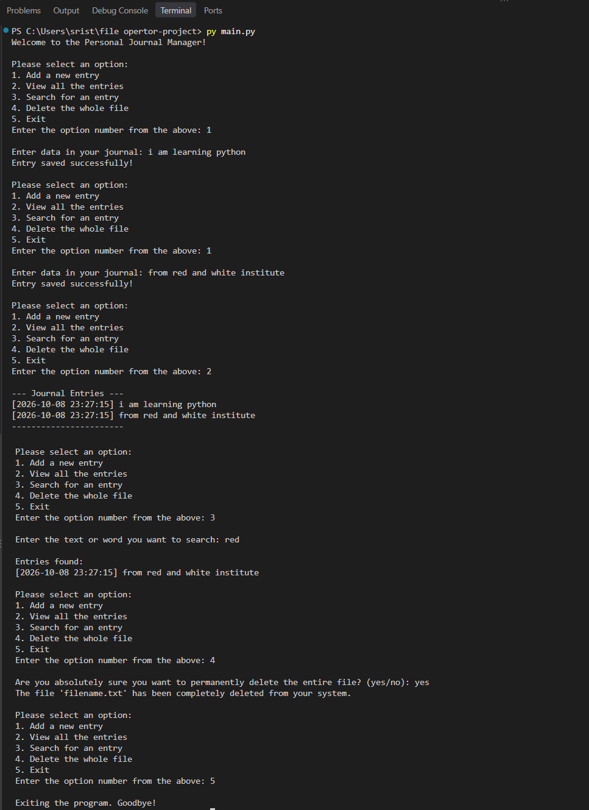

# 1.📔 Personal Journal Manager

A simple command-line journal application written in Python that lets you write, view, search, and delete your journal entries, with every entry automatically timestamped.

---

## 2. 📁 Project Structure

```
│──main.py
├──output.png
└── README.md 
```

---

## 3. 📝 Project Description

**Personal Journal Manager** is a beginner-friendly Python project that uses file handling and object-oriented programming to store journal entries in a plain text file. The program runs in the terminal and shows a menu from which the user can add new entries, read all past entries, search for entries by keyword, or delete the whole journal file.

Each entry is saved with the exact date and time it was written, in the format:

```
[2025-01-15 21:30:45] Today I started learning file handling in Python.
```

---

## 4. ✨ Features

- ➕ **Add entries**: write a new journal entry; empty entries are rejected
- 🕒 **Automatic timestamps**: every entry is saved with the current date and time
- 📖 **View all entries**: display the full journal in a clean format
- 🔍 **Search**: find entries by keyword (case-insensitive; matches both text and timestamp)
- 🗑️ **Delete the journal**: permanently delete the file, with a `yes/no` confirmation to prevent accidents
- 🛡️ **Error handling**: handles missing files, invalid menu input, and permission errors
- 📄 **Auto file creation**: the journal file is created automatically if it doesn't exist

---

## 5. 🛠️ Technologies Used

| Technology | Purpose |
|------------|---------|
| **Python 3** | Core programming language |
| **`datetime` module** | Generating timestamps for entries |
| **`os` module** | Checking for and deleting the journal file |
| **Text file (`.txt`)** | Storing journal entries |
| **VS Code** | Code editor used for development |
| **Git** | Version control |
| **GitHub** | Hosting the repository |

---

## 6. 🚀 How to Run | Installation

### Prerequisites
- [Python 3.x](https://www.python.org/downloads/) installed on your system
- (Optional) [Git](https://git-scm.com/) to clone the repository

### Steps

1. **Clone the repository**
   ```bash
   git clone https://github.com/your-username/Personal-Journal-Manager.git
   ```

2. **Go to the project folder**
   ```bash
   cd Personal-Journal-Manager
   ```

3. **Run the program**
   ```bash
   python journal_manager.py
   ```
   *(On some systems use `python3 journal_manager.py`.)*

4. **Choose an option from the menu**
   ```
   1. Add a new entry
   2. View all the entries
   3. Search for an entry
   4. Delete the whole file
   5. Exit
   ```

No external libraries are required, since the program uses only Python's standard library.

---

## 7. 📸 Output | Screenshots

### Main Menu



## 8. 👤 Author

**NAME**-**SRIJAN KUMAR MAURYA**

---